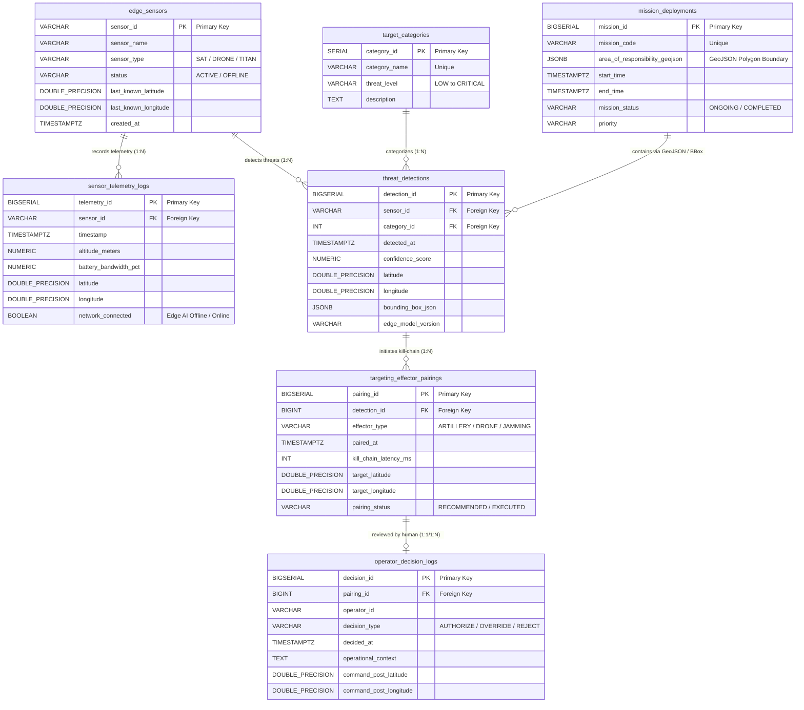

# Palantir DB

This the the repository for a mock database themed around the software company Palantir. A Business Intelligence assignment.

## Database Design



Master tables are

- `edge_sensors`
- `target_categories`

While the rest are transactional tables:

- `mission_deployments`
- `sensor_telemetry_logs`
- `threat_detections`
- `targeting_effector_pairings`
- `operator_decision_logs`

## How to Replicate

1. Clone this repository:

```sh
git clone https://github.com/orizynpx/bi-palantir-db.git
```

2. Run the Docker Compose command (it initializes and seeds the Postgre DB):

```sh
docker compose up -d
```

3. Enter the database shell to write SQL statements:

```sh
docker exec -it palantir_db psql -U admin -d palantir_ops
```

4. Use this SQL statement to verify the number of rows for each of the transactional tables:

```sh
SELECT 'mission_deployments' AS table_name, COUNT(*) AS row_count FROM mission_deployments
UNION ALL
SELECT 'sensor_telemetry_logs', COUNT(*) FROM sensor_telemetry_logs
UNION ALL
SELECT 'threat_detections', COUNT(*) FROM threat_detections
UNION ALL
SELECT 'targeting_effector_pairings', COUNT(*) FROM targeting_effector_pairings
UNION ALL
SELECT 'operator_decision_logs', COUNT(*) FROM operator_decision_logs;
```

## Credits

- **Arya Arrozza Ridho Syaputra (2410817210010):** Database design
- **Noor Muhammad Akmal Sulaiman (2410817210007):** PostgreSQL implementation on Docker container
