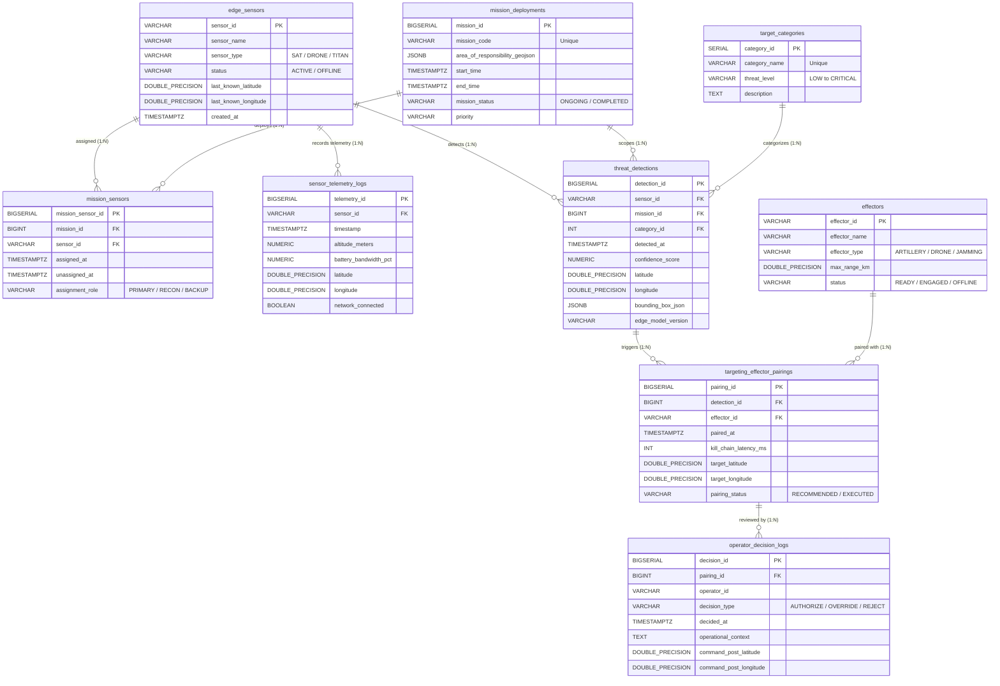

# Palantir DB

This the the repository for a mock database themed around the software company Palantir. A Business Intelligence assignment.

## Database Design


```mermaid
erDiagram
    edge_sensors ||--o{ mission_sensors : "assigned (1:N)"
    mission_deployments ||--o{ mission_sensors : "deploys (1:N)"
    edge_sensors ||--o{ sensor_telemetry_logs : "records telemetry (1:N)"
    edge_sensors ||--o{ threat_detections : "detects (1:N)"
    mission_deployments ||--o{ threat_detections : "scopes (1:N)"
    target_categories ||--o{ threat_detections : "categorizes (1:N)"
    threat_detections ||--o{ targeting_effector_pairings : "triggers (1:N)"
    effectors ||--o{ targeting_effector_pairings : "paired with (1:N)"
    targeting_effector_pairings ||--o{ operator_decision_logs : "reviewed by (1:N)"

    edge_sensors {
        VARCHAR sensor_id PK
        VARCHAR sensor_name
        VARCHAR sensor_type "SAT / DRONE / TITAN"
        VARCHAR status "ACTIVE / OFFLINE"
        DOUBLE_PRECISION last_known_latitude
        DOUBLE_PRECISION last_known_longitude
        TIMESTAMPTZ created_at
    }

    mission_deployments {
        BIGSERIAL mission_id PK
        VARCHAR mission_code "Unique"
        JSONB area_of_responsibility_geojson
        TIMESTAMPTZ start_time
        TIMESTAMPTZ end_time
        VARCHAR mission_status "ONGOING / COMPLETED"
        VARCHAR priority
    }

    mission_sensors {
        BIGSERIAL mission_sensor_id PK
        BIGINT mission_id FK
        VARCHAR sensor_id FK
        TIMESTAMPTZ assigned_at
        TIMESTAMPTZ unassigned_at
        VARCHAR assignment_role "PRIMARY / RECON / BACKUP"
    }

    target_categories {
        SERIAL category_id PK
        VARCHAR category_name "Unique"
        VARCHAR threat_level "LOW to CRITICAL"
        TEXT description
    }

    sensor_telemetry_logs {
        BIGSERIAL telemetry_id PK
        VARCHAR sensor_id FK
        TIMESTAMPTZ timestamp
        NUMERIC altitude_meters
        NUMERIC battery_bandwidth_pct
        DOUBLE_PRECISION latitude
        DOUBLE_PRECISION longitude
        BOOLEAN network_connected
    }

    threat_detections {
        BIGSERIAL detection_id PK
        VARCHAR sensor_id FK
        BIGINT mission_id FK
        INT category_id FK
        TIMESTAMPTZ detected_at
        NUMERIC confidence_score
        DOUBLE_PRECISION latitude
        DOUBLE_PRECISION longitude
        JSONB bounding_box_json
        VARCHAR edge_model_version
    }

    effectors {
        VARCHAR effector_id PK
        VARCHAR effector_name
        VARCHAR effector_type "ARTILLERY / DRONE / JAMMING"
        DOUBLE_PRECISION max_range_km
        VARCHAR status "READY / ENGAGED / OFFLINE"
    }

    targeting_effector_pairings {
        BIGSERIAL pairing_id PK
        BIGINT detection_id FK
        VARCHAR effector_id FK
        TIMESTAMPTZ paired_at
        INT kill_chain_latency_ms
        DOUBLE_PRECISION target_latitude
        DOUBLE_PRECISION target_longitude
        VARCHAR pairing_status "RECOMMENDED / EXECUTED"
    }

    operator_decision_logs {
        BIGSERIAL decision_id PK
        BIGINT pairing_id FK
        VARCHAR operator_id
        VARCHAR decision_type "AUTHORIZE / OVERRIDE / REJECT"
        TIMESTAMPTZ decided_at
        TEXT operational_context
        DOUBLE_PRECISION command_post_latitude
        DOUBLE_PRECISION command_post_longitude
    }
```

Master tables are

- `edge_sensors`
- `target_categories`

While the rest are transactional tables:

- `mission_deployments`
- `sensor_telemetry_logs`
- `threat_detections`
- `targeting_effector_pairings`
- `operator_decision_logs`

## Dimensional Modelling

```mermaid
erDiagram
    dim_sensor ||--o{ fact_threat_detections : "sources"
    dim_mission ||--o{ fact_threat_detections : "scopes"
    dim_target_category ||--o{ fact_threat_detections : "classifies"
    dim_geography ||--o{ fact_threat_detections : "located_at"
    dim_date ||--o{ fact_threat_detections : "detected_on"

    dim_sensor ||--o{ fact_killchain_decisions : "detecting_sensor"
    dim_mission ||--o{ fact_killchain_decisions : "operational_mission"
    dim_target_category ||--o{ fact_killchain_decisions : "threat_category"
    dim_effector ||--o{ fact_killchain_decisions : "assigned_effector"
    dim_operator ||--o{ fact_killchain_decisions : "deciding_operator"
    dim_date ||--o{ fact_killchain_decisions : "decided_on"

    dim_sensor ||--o{ fact_sensor_telemetry_snapshot : "monitors"
    dim_mission ||--o{ fact_sensor_telemetry_snapshot : "deploys"
    dim_geography ||--o{ fact_sensor_telemetry_snapshot : "tracked_at"
    dim_date ||--o{ fact_sensor_telemetry_snapshot : "logged_on"
    dim_time ||--o{ fact_sensor_telemetry_snapshot : "logged_at"

    dim_sensor {
        BIGINT sensor_key PK "Surrogate Key"
        VARCHAR sensor_id "Natural Key"
        VARCHAR sensor_name
        VARCHAR sensor_type
        VARCHAR status
        BOOLEAN is_current "SCD Type 2"
        DATE valid_from
        DATE valid_to
    }

    dim_mission {
        BIGINT mission_key PK "Surrogate Key"
        BIGINT mission_id "Natural Key"
        VARCHAR mission_code
        VARCHAR mission_status
        VARCHAR priority
    }

    dim_target_category {
        INT category_key PK "Surrogate Key"
        INT category_id "Natural Key"
        VARCHAR category_name
        VARCHAR threat_level
    }

    dim_effector {
        BIGINT effector_key PK "Surrogate Key"
        VARCHAR effector_id "Natural Key"
        VARCHAR effector_name
        VARCHAR effector_type
        NUMERIC max_range_km
        BOOLEAN is_current "SCD Type 2"
    }

    dim_operator {
        BIGINT operator_key PK "Surrogate Key"
        VARCHAR operator_id "Natural Key"
        VARCHAR command_post_unit
        VARCHAR clearance_level
    }

    dim_geography {
        BIGINT geography_key PK "Surrogate Key"
        VARCHAR h3_index_r7
        VARCHAR geohash_6
        DOUBLE_PRECISION latitude
        DOUBLE_PRECISION longitude
        VARCHAR region_name
    }

    dim_date {
        INT date_key PK "YYYYMMDD"
        DATE full_date
        INT year
        INT quarter
        INT month
        INT day_of_week
    }

    dim_time {
        INT time_key PK "HHMMSS"
        INT hour
        INT minute
        INT second
    }

    fact_threat_detections {
        BIGINT detection_fact_id PK "Surrogate Key"
        BIGINT sensor_key FK
        BIGINT mission_key FK
        INT category_key FK
        BIGINT geography_key FK
        INT detected_date_key FK
        VARCHAR edge_model_version "Degenerate Dim"
        VARCHAR detection_id "Degenerate Dim"
        NUMERIC confidence_score "Measure"
        INT detection_count "Additive Measure"
    }

    fact_killchain_decisions {
        BIGINT decision_fact_id PK "Surrogate Key"
        BIGINT sensor_key FK
        BIGINT mission_key FK
        INT category_key FK
        BIGINT effector_key FK
        BIGINT operator_key FK
        INT decided_date_key FK
        VARCHAR pairing_status "Degenerate Dim"
        VARCHAR decision_type "Degenerate Dim"
        TEXT operational_context "Degenerate Dim"
        INT kill_chain_latency_ms "Measure"
        INT operator_response_latency_ms "Measure"
        INT total_end_to_end_latency_ms "Measure"
        INT is_authorized "Flag (0/1)"
        INT is_overridden "Flag (0/1)"
    }

    fact_sensor_telemetry_snapshot {
        BIGINT telemetry_snapshot_id PK "Surrogate Key"
        BIGINT sensor_key FK
        BIGINT mission_key FK
        BIGINT geography_key FK
        INT snapshot_date_key FK
        INT snapshot_time_key FK
        NUMERIC avg_altitude_meters "Measure"
        NUMERIC min_battery_bandwidth_pct "Measure"
        INT network_uptime_seconds "Measure"
        INT telemetry_event_count "Additive Measure"
    }
```
Fact tables are

- `fact_threat_detections`
- `fact_killchain_decisions`
- `fact_sensor_telemetry_snapshot`

Dimensional modelling for `fact_threat_detections`

- `dim_sensor`
- `dim_mission`
- `dim_target_category`
- `dim_geography`
- `dim_date`

Dimensional modelling for `fact_killchain_decisions`

- `dim_sensor`
- `dim_mission`
- `dim_target_category`
- `dim_effector`
- `dim_operator`
- `dim_date`

Dimensional modelling for `fact_sensor_telemetry_snapshot`

- `dim_sensor`
- `dim_mission`
- `dim_geography`
- `dim_date`
- `dim_time`

## How to Replicate

1. Clone this repository:

```sh
git clone https://github.com/orizynpx/bi-palantir-db.git
```

2. Run the Docker Compose command (it initializes and seeds the Postgre DB):

```sh
docker compose up -d
```

3. Enter the database shell to write SQL statements:

```sh
docker exec -it palantir_db psql -U admin -d palantir_ops
```

4. Use this SQL statement to verify the number of rows for each of the transactional tables:

```sh
SELECT 'dim_sensor' AS table_name, COUNT(*) AS row_count FROM dim_sensor
UNION ALL
SELECT 'dim_mission', COUNT(*) FROM dim_mission
UNION ALL
SELECT 'dim_target_category', COUNT(*) FROM dim_target_category
UNION ALL
SELECT 'dim_effector', COUNT(*) FROM dim_effector
UNION ALL
SELECT 'dim_operator', COUNT(*) FROM dim_operator
UNION ALL
SELECT 'dim_geography', COUNT(*) FROM dim_geography
UNION ALL
SELECT 'dim_date', COUNT(*) FROM dim_date
UNION ALL
SELECT 'dim_time', COUNT(*) FROM dim_time
UNION ALL
SELECT 'fact_threat_detections', COUNT(*) FROM fact_threat_detections
UNION ALL
SELECT 'fact_killchain_decisions', COUNT(*) FROM fact_killchain_decisions
UNION ALL
SELECT 'fact_sensor_telemetry_snapshot', COUNT(*) FROM fact_sensor_telemetry_snapshot
ORDER BY row_count DESC;
```

## Credits

- **Arya Arrozza Ridho Syaputra (2410817210010):** Database design
- **Noor Muhammad Akmal Sulaiman (2410817210007):** PostgreSQL implementation on Docker container
